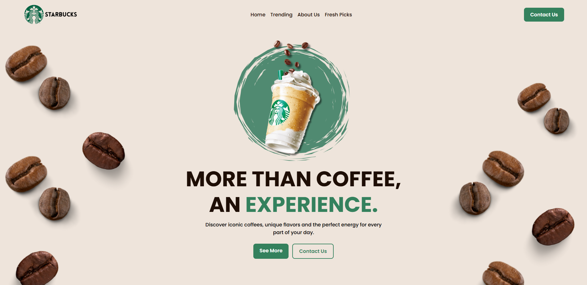
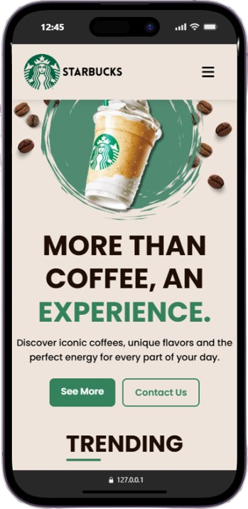

<h1 align="center" style="font-weight: bold;">☕ STARBUCKS LANDING PAGE</h1>

<p align="center">
    <b>This project was developed to improve my front-end development skills, focusing on responsive layouts, user interface design, and JavaScript interactions. It is part of my personal portfolio and represents my continuous learning journey as a developer.</b>
</p>

<h2 id="layout">🎨 Layout</h2>

<p align="center">
    
</p>
<p align="center">
    
</p>

<h2 id="technologies">💻 Technologies</h2>

<p>
   HTML5
  <br>
   CSS3
  <br>
   JavaScript
</p>

<h2 id="features">✨ Features</h2>

<p>
    • Responsive design for mobile, tablet, and desktop<br>
    • Interactive mobile navigation menu (hamburger menu)<br>
    • Header shadow effect triggered by page scroll<br>
    • Clean CSS structure utilizing separated files (styles, navbar, and variables)<br>
    • Section-based architecture (Home, Trending, About Us, Fresh Picks)<br>
    • Modern coffee shop UI design with FontAwesome icons
</p>

<h2 id="started">🚀 Getting started</h2>

<h3>Prerequisites</h3>

The following tools are required to run the project locally:

- [Git](https://git-scm.com)
- [Any Modern Web Browser](https://www.google.com/chrome/)

<h3>Cloning</h3>

```bash
git clone [https://github.com/gabrielolivete/starbucks-landing-page.git](https://github.com/gabrielolivete/starbucks-landing-page.git)
```

<h3>Starting</h3>

```bash
cd starbucks-landing-page
```
<p>Open "index.html" directly in your browser or use the VS Code Live Server extension for a better development experience.</p>


<br>
<br>

<p>
     <a href="https://gabrielolivete.github.io/starbucks-pjt/">📱 Visit this Project</a>
</p>

<br>
<br>

<h2 id="learn">💾 What I Learned</h2>

- Organized project files systematically using a src/ folder for assets, css, and js.
- Implemented CSS architecture separating files into variables.css for design consistency and navbar.css for layout modularity.
- Created dynamic interface interactions using JavaScript DOM manipulation (classList.toggle and scroll event listeners).
- Enhanced responsive layout adaptation across multiple sections from desktop to mobile screens.

<hr>

<p align="center">
Built with 🧋 and code by Gabriel Olivete
</p>
